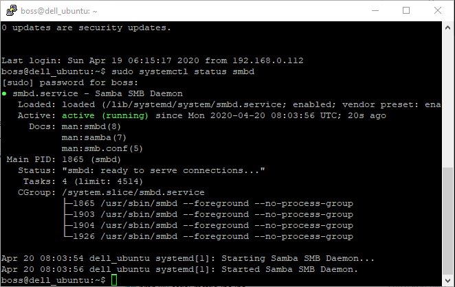
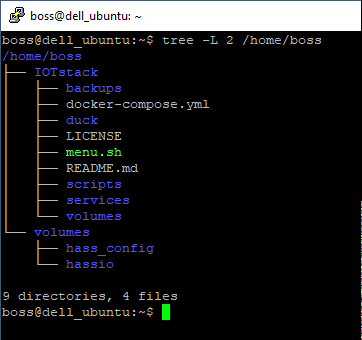

# Getting Started

A guide to installing and setting up [Home Assistant](https://www.home-assistant.io/) inside Docker on Ubuntu 18.04 LTS

I've written this guide to help myself but if you are reading this I hope you also find it useful.

We will step through the process of setting up a supervised install of Home Assistant running in Docker containers on an Ubuntu 18.04 LTS server. In this case an old Dell Latitude laptop which is proving to make a great server. Later we will add Portainer, Mosquitto, Node-RED, InfluxDB & Grafana.

>If you are new to Linux you shouldn't be trying to do this however this guide by Justin Ellingwood on DigitalOcean will help with [basic linux navigation and file commands](#https://www.digitalocean.com/community/tutorials/basic-linux-navigation-and-file-management)

## 1. Ubuntu House Keeping

Start by installing Ubuntu, this is a simple and normally painless process. Follow one of the many guides on the internetif you need. Once installed and logged in we need to do some house keeping in Ubuntu.

```bash
sudo apt update
sudo apt upgrade
sudo apt dist-upgrade
sudo apt autoremove
```

## 2. Setup secure ssh access with key pair

Followed guide by [DevAnswers](https://devanswers.co/putty-and-ssh-key-based-authentication/) to setup ssh access with key pair via PuTTY

## 3. Set a static IP address

Followed guide on [linuxize](https://linuxize.com/post/how-to-configure-static-ip-address-on-ubuntu-18-04/) to set a static IP 

Starting with 17.10 release, Netplan is the default network management tool on Ubuntu. Netplan uses configuration files in YAML syntax. To configure a network interface with Netplan, you need to create a YAML description for that interface, and Netplan will generate the required configuration files for your chosen renderer tool.

Netplan currently supports two renderers NetworkManager and Systemd-networkd. NetworkManager is mostly used on Desktop machines while the Systemd-networkd is used on servers without a GUI.

### Configuring Static IP address on Ubuntu Server

Ubuntu 18.04 (and later) uses ‘Predictable Network Interface Names’ that, by default, start with `en[letter][number]`

Use `ip link` to show the ethernet interface, in my case eno1

```bash
ip link
```
Netplan configuration files are stored in the /etc/netplan directory and have the extension .yaml. You’ll probably find one or two YAML files in this directory. The file may differ from setup to setup. Usually, the file is named either 01-netcfg.yaml, 50-cloud-init.yaml, or NN_interfaceName.yaml, but in your system it may be different.

In my case:

```bash
sudo nano /etc/netplan/50-cloud-init.yaml
```

change the line under addresses to your static IP, also check gateway IP address is correct and change the nameservers if you want - [see list here](https://www.increasebroadbandspeed.co.uk/uk-isp-dns-server-settings)

```yaml
network:
    version: 2
    ethernets:
        eno1:
            dhcp4: no
            addresses:
              - 192.168.0.199/24
            gateway4: 192.168.0.1
            nameservers:
                addresses: [8.8.8.8, 1.1.1.1]
```

When editing Yaml files, make sure you follow the YAML code indent standards. If there are syntax errors in the configuration, the changes will not be applied.

Then apply changes with

```bash
sudo netplan apply
```

## 4. Install Docker

Based on an excellent guide written by Brian Hogan hosted on [DigitalOcean](https://www.digitalocean.com/community/tutorials/how-to-install-and-use-docker-on-ubuntu-18-04)

First, update your existing list of packages:

```bash
sudo apt update
```

Next, install a few prerequisite packages which let apt use packages over HTTPS:

```bash
sudo apt install apt-transport-https ca-certificates curl software-properties-common
```

Then add the GPG key for the official Docker repository to your system:

```bash
curl -fsSL https://download.docker.com/linux/ubuntu/gpg | sudo apt-key add -
```

Add the Docker repository to APT sources:

```bash
sudo add-apt-repository "deb [arch=amd64] https://download.docker.com/linux/ubuntu bionic stable"
```

Next, update the package database with the Docker packages from the newly added repo:

```bash
sudo apt update
```

Make sure you are about to install from the Docker repo instead of the default Ubuntu repo:

```bash
apt-cache policy docker-ce
```

Finally, install Docker:

```bash
sudo apt install docker-ce
```

Docker should now be installed, the daemon started, and the process enabled to start on boot. Check that it’s running:

```bash
sudo systemctl status docker
```

The output should be similar to the following, showing that the service is active and running:

```bash
Output
● docker.service - Docker Application Container Engine
   Loaded: loaded (/lib/systemd/system/docker.service; enabled; vendor preset: enabled)
   Active: active (running) since Thu 2018-07-05 15:08:39 UTC; 2min 55s ago
     Docs: https://docs.docker.com
 Main PID: 10096 (dockerd)
    Tasks: 16
   CGroup: /system.slice/docker.service
           ├─10096 /usr/bin/dockerd -H fd://
           └─10113 docker-containerd --config /var/run/docker/containerd/containerd.toml
```

To ensure that Docker starts when the server boots enter the following:

```bash
sudo systemctl enable docker
```

To execute Docker commands without sudo add our user to docker group

```bash
sudo usermod -aG docker ${USER}
su - ${USER}
```

Confirm that your user is now added to the docker group by typing:

```bash
id -nG
```

To test Docker

```bash
docker run hello-world
```

The output will indicate that Docker in working correctly:

```bash
Output
Unable to find image 'hello-world:latest' locally
latest: Pulling from library/hello-world
9bb5a5d4561a: Pull complete
Digest: sha256:3e1764d0f546ceac4565547df2ac4907fe46f007ea229fd7ef2718514bcec35d
Status: Downloaded newer image for hello-world:latest

Hello from Docker!
This message shows that your installation appears to be working correctly.
...
```

Docker was initially unable to find the hello-world image locally, so it downloaded the image from Docker Hub, which is the default repository. Once the image downloaded, Docker created a container from the image and the application within the container executed, displaying the message.

## 5. Install Portainer to manage Docker via GUI

https://clouding.io/hc/en-us/articles/360010398219-Install-Portainer-on-Ubuntu-18-04

```bash
docker volume create portainer_data
```

```bash
docker run -d -p 9000:9000 -v /var/run/docker.sock:/var/run/docker.sock -v portainer_data:/data portainer/portainer
```

You check with `docker ps`

Then you can login via port 9000, so in this case 192.168.0.199:9000

* Username: admin
* Password: admin


## 6. Install Supervised Home Automation in Docker

Everthing you need can be found [on github](https://github.com/home-assistant/supervised-installer)

I had to install docker compose first with

```bash
sudo apt install docker-compose
```

get Root access so type the command: `sudo -i` then install required prerequisites

```bash
apt-get install \
  apparmor-utils \
  avahi-daemon \
  dbus \
  jq \
  network-manager \
  socat
```

(or run as root with `sudo su` then exit to return to user)

Install (using default command)

```bash
curl -sL https://raw.githubusercontent.com/home-assistant/supervised-installer/master/installer.sh | bash -s
```

will result in config files being located at: _/usr/share/hassio/homeassistant_

If you want to change the file locations use option `-- -d <your path>` like this example:

```bash
curl -sL https://raw.githubusercontent.com/home-assistant/supervised-installer/master/installer.sh | bash -s -- -d /home/boss/volumes/hassio
```

Start portainer with

```bash
docker run -d -p 9000:9000 -v /var/run/docker.sock:/var/run/docker.sock -v portainer_data:/data --restart always --name=portainer portainer/portainer
```

and check you can access the web interface at [localhost:9000](http://192.168.0.199:9000)
(unless you changed it to something else on the line above to a different port!)

You can connect to homeassistant cli via portainer and use `ha core stop`, then stop the supervisor with

```bash
sudo systemctl stop hassio-supervisor.service
```

You can then stop the other support homeassistant containers using portainer.

Optional stop it restarting at next boot

```bash
sudo systemctl disable hassio-supervisor.service
```

and start with (you need to start homeassistant separately once the supervisor is running)

```bash
sudo systemctl start hassio-supervisor.service
```

## 7. Install and setup Samba

>Followed parts from both guides but bound my existing user (boss) instead of creating new one as shown in guides

<https://linuxize.com/post/how-to-install-and-configure-samba-on-ubuntu-18-04/>

<https://www.linuxbabe.com/ubuntu/install-samba-server-file-share>

```bash
sudo apt update
sudo apt install samba
```

Once the installation is completed, the Samba service will start automatically. To check whether the Samba server is running, type:

```bash
sudo systemctl status smbd
```



At this point, Samba has been installed and ready to be configured.
Before making changes to the Samba configuration file, create a backup for future reference purposes:

```bash
sudo cp /etc/samba/smb.conf{,.backup}
```

The default configuration file that ships with the Samba package is configured for standalone Samba server. Open the file and make sure server role is set to standalone server

```bash
sudo nano /etc/samba/smb.conf
```

I made the following changes
changed workgroup:

```bash
workgroup = HOME
```

changed interface to eno1:

```bash
interfaces = 127.0.0.0/8 eno1
bind interfaces only = yes
```

And at the end added the folders we want to share:

```bash
[Hassio]
comment = needs username and password to access
path = /home/boss/volumes/hassio/
browseable = yes
guest ok = no
writable = yes
valid users = @samba

[IoT]
comment = needs username and password to access
path = /home/boss/volumes/IoT/
browseable = yes
guest ok = no
writable = yes
valid users = @samba
```

Next run the following command to check if there’s syntactic errors.

```bash
testparm
```

Rather than create a new user as in guide I have chosen to add my existing user.
First we need to set a separate Samba password for the new user with the following command:

```bash
sudo smbpasswd -a boss
```

Create the samba group.

```bash
sudo groupadd samba
```

And add this user to the samba group.

```bash
sudo gpasswd -a boss samba
```

Create the private share folder.

```bash
sudo mkdir -p /srv/samba/private/
```

The samba group needs to have read, write and execute permission on the shared folder. You can grant these permissions by executing the following command.

```bash
sudo setfacl -R -m "g:samba:rwx" /srv/samba/private/
```

### Optional extra

```bash
sudo apt-get install tree
tree -L 2 /home/boss
```



```bash
└── volumes
    ├── hass_config (un-supervised i.e. single container)
    └── hassio (supervised)
```

## 8. Home Assistant Addons

>Let's try home assistant addons rather than IOTstack

InfluxDB - set SSL to false, enabled web interface on port 8888 a0d7b954_influxdb

Grafana - set SSL to false, enabled web interface on port 3000 a0d7b954_grafana

Mosquitto - nothing4

Node-RED - set SSL to false, must set credential_secret: test

InfluxDB
Created db homeassistant
Add user homeassistant with permissions password = test
Add user grafana with permissions password = test

Grafana (can login via webpage using peter / test)
Create data source using internal link to [Docker container](http://a0d7b954-influxdb:8086)

Using [Google drive backup addon by Stephen Beechen](https://github.com/sabeechen/hassio-google-drive-backup). Add his github as repository in Home Assistant then install the addon like any other


## 9. Tidying Up

>My install is on an old laptop so I need to make some changes so I can close the lid without it going to sleep

### Disable sleep when lid shut (not on docking station)

If you're not logged in as root, you'll need to add "sudo " to invoke the editor as in:

```bash
sudo nano /etc/systemd/logind.conf
```

In the file above, I changed only this line:

```bash
HandleLidSwitch=suspend
```

to this:

```bash
HandleLidSwitch=ignore
```

After saving the file, I ran:

```bash
sudo systemctl restart systemd-logind
```

This immediately resolved the problem.

From <https://www.dell.com/community/Linux-General/Stop-laptop-going-to-sleep-when-closing-the-lid-UBUNTU-Server/td-p/6086201>

### And to turn off the LCD when the lid is shut…

```bash
sudo apt-get install vbetool
```

As for the commands, to turn off add as shortcut:

```bash
sudo vbetool dpms off
```

And to turn on:

```bash
sudo vbetool dpms on
```

From <https://help.ubuntu.com/community/vbetool>

## Install IoT stack (Mosquitto, InfluxDB, Grafana & Node-RED)

>*Originally I tried using an IoT stack installed as Docker containers with a script by Graham Garner. His install process worked well but I ran into problems within Home Assistant so abandon this in favour of using Addons within Home Assistant - much easier!*

Inspiration from Andreas Spiess video #295 Raspberry Pi Server based on Docker, with VPN, Dropbox backup, Influx, Grafana, etc. using <https://github.com/gcgarner/IOTstack>

Download the repository with:

```bash
git clone https://github.com/gcgarner/IOTstack.git ~/IOTstack
```

then change directory

```bash
cd ~/IOTstack
```

Run the menu script to build our stack of containers - Mosquitto, InfluxDB, Grafana & Node-RED. Then select the Node-RED palettes.

```bash
./menu.sh
```

Then start the stack!

```bash
docker-compose up -d
```

To stop use `docker-compose stop` , this stops without removing containers

[Portainer on port 9000](http://192.168.0.199:9000)

[Home Assistant on port 8123](http://192.168.0.199:8123)

[Node-RED on port 1880](http://192.168.0.199:1880)

[Grafana on port 3000](http://192.168.0.199:3000)

* username admin
* password admin

Mosquitto uses port 1883

InfluxDB on ports 8086 8083 2003
